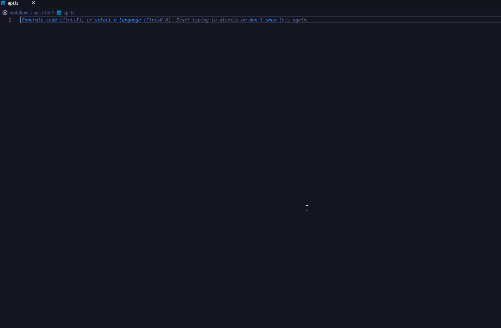
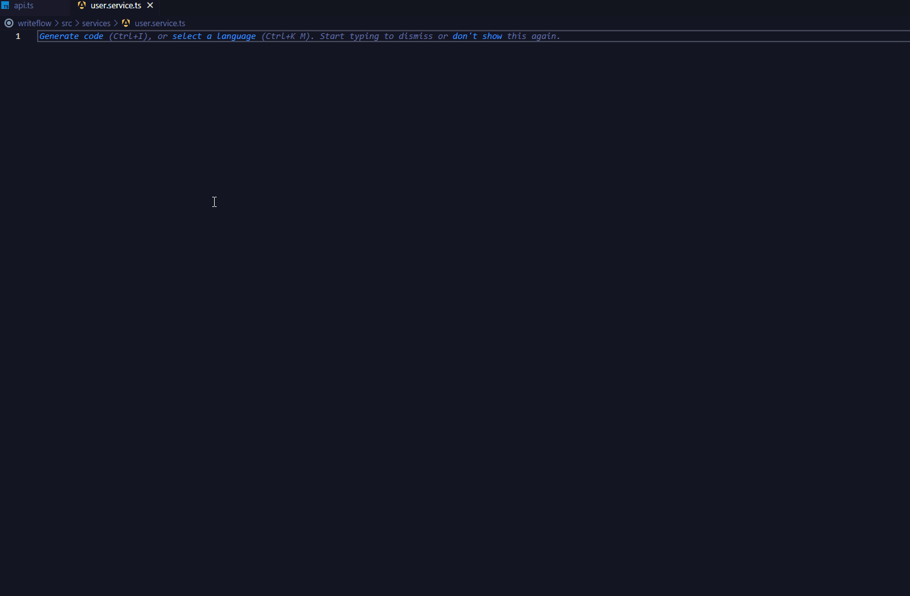
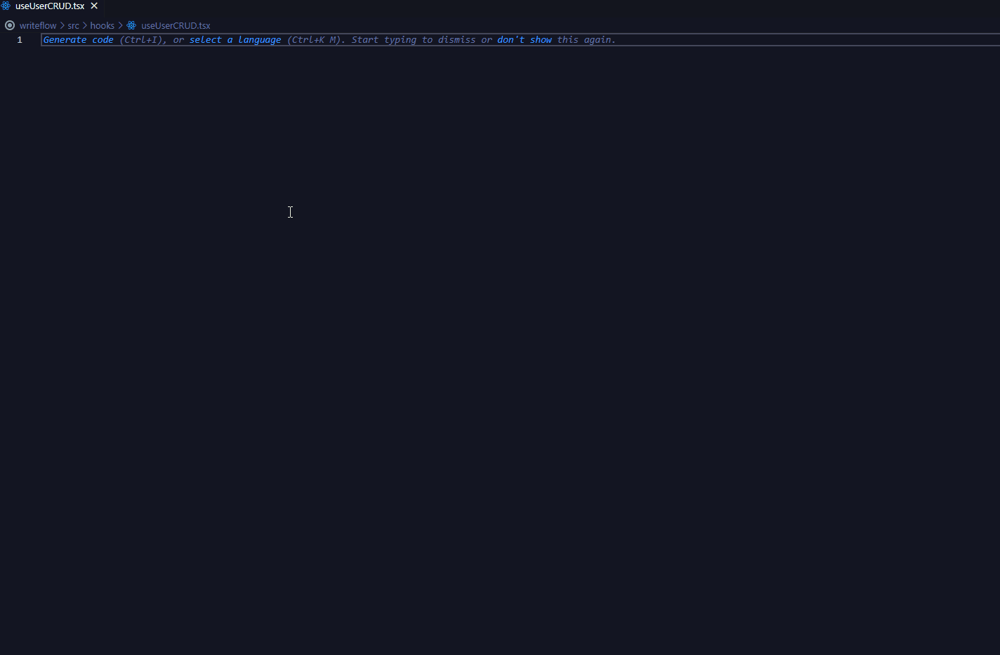
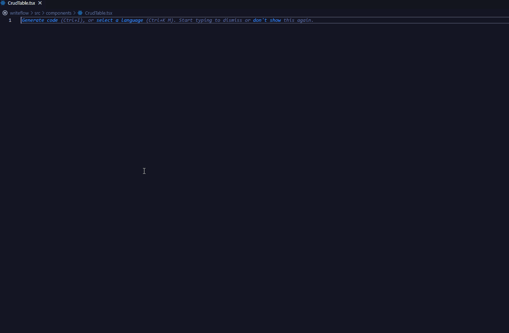
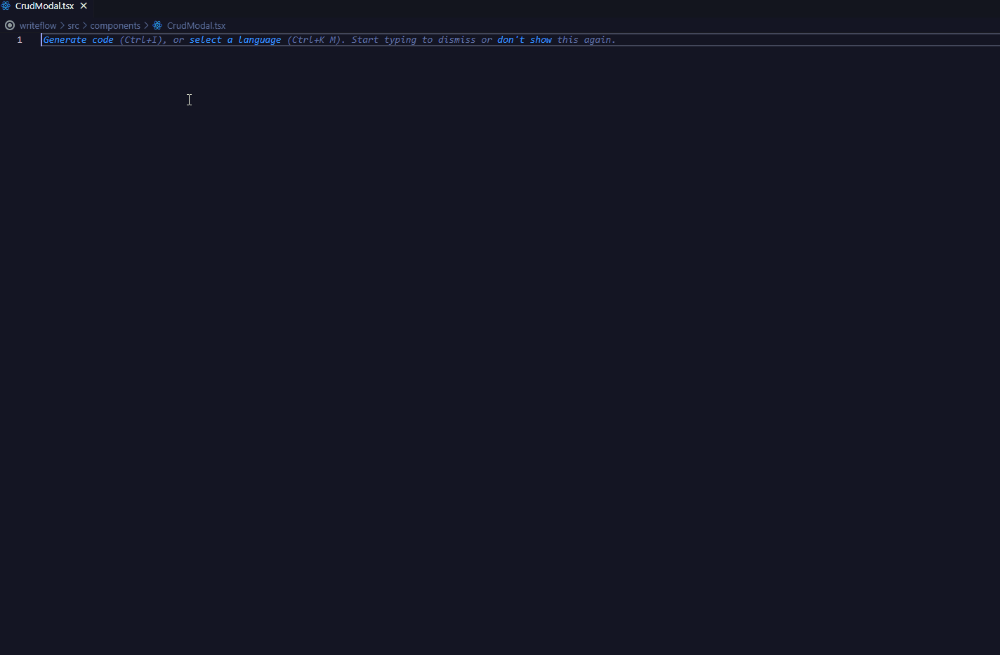
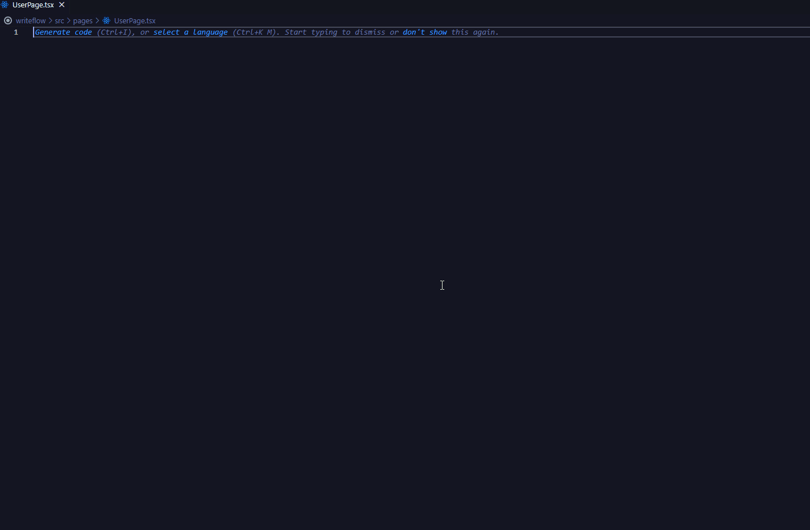

# React Ant Design CRUD Snippets

A collection of **VS Code snippets** to scaffold complete **CRUD (Create, Read, Update, Delete)** functionality with **React + TypeScript + Ant Design + Axios**.  
Speed up building admin dashboards and management systems.

---

## Project Structure

```text
src/
├── lib/
│   └── api.ts              # axiosapi
├── services/
│   └── user.service.ts     # crudservice
├── hooks/
│   └── useUserCRUD.tsx     # crudhooks
├── components/
│   ├── CrudTable.tsx       # crudtable
│   └── CrudModal.tsx       # crudmodal
└── pages/
    └── UserPage.tsx        # crudpage
```

---

## Snippets

### 1. Axios API Instance

**Prefix:** `axiosapi`  
**Description:** Creates pre-configured Axios instance with interceptors.



**Features:**

- Environment-based `baseURL` configuration
- Automatic JWT token attachment to requests
- Response interceptor for handling `401 Unauthorized` errors
- Default 10-second timeout

---

### 2. CRUD Service Layer

**Prefix:** `crudservice`  
**Description:** Generates RESTful CRUD service with Axios.



**Features:**

- TypeScript interfaces for entities and parameters
- Pagination support with typed params
- Full CRUD (`getList`, `getById`, `create`, `update`, `remove`)
- Generic response types

---

### 3. CRUD Form Components

**Description:** Collection of Ant Design `Form.Item` snippets.
**Prefixes:**

- `finput` → Input
- `fselect` → Select
- `ftextarea` → TextArea
- `fswitch` → Switch
- `fcheckbox` → Checkbox
- `fradio` → Radio.Group
- `fupload` → Upload
- `fdatepicker` → DatePicker
- `frangepicker` → RangePicker
- `finputnumber` → InputNumber
- `fpassword` → Password field
- `sopt` → Select.Option
- `useform` → `Form.useForm()` hook

---

### 4. CRUD Hooks

**Prefix:** `crudhooks`  
**Description:** Custom React hook for CRUD state management.



**Features:**

- Loading & error states per action (create, update, delete)
- Automatic refetch after mutations
- Parameter-based data fetching
- Typed with interfaces

---

### 5. CRUD Table Component

**Prefix:** `crudtable`  
**Description:** Configurable Ant Design table with actions.



**Features:**

- Edit, Delete, View actions
- Configurable action visibility
- Pagination (`showTotal`, `showSizeChanger`, `pageSizeOptions`)
- Row selection
- Type-safe columns

---

### 6. CRUD Modal

**Prefix:** `crudmodal`  
**Description:** Generic modal for create/edit operations.



**Features:**

- Various input types included (Input, Number, Select, DatePicker, Switch, Checkbox, Radio, Upload, TextArea)
- Automatic form reset on close
- Generic TypeScript support
- Loading state

---

### 7. CRUD Page

**Prefix:** `crudpage`  
**Description:** Full page integrating all snippets.



**Features:**

- Action bar with `Add New`, `Export`
- Table display with data
- Modal for create/edit operations
- Uses custom `useEntityCRUD` hook

---

## Quick Start Guide

### 1. Setup API Configuration

Type: `axiosapi` → Creates axios instance at `src/lib/api.ts`.

### 2. Create Service Layer

Type: `crudservice` → Generates `UserService` in `src/services`.

### 3. Build Data Hook

Type: `crudhooks` → Creates `useUserCRUD` in `src/hooks`.

### 4. Create Components

Type: `crudtable` → Table component.  
Type: `crudmodal` → Modal component.

### 5. Build Page

Type: `crudpage` → Complete CRUD page.

### 6. Add Form Fields

Type: `finput`, `fselect`, `ftextarea`, etc.

---

## Benefits

- Scaffold CRUD features in seconds
- Reusable components (Table, Modal, Form, Hook)
- Consistent structure for React + Ant Design apps
- Type-safe and extendable
- Visual documentation with GIF demos

---

## License

MIT License - feel free to use in your projects!
